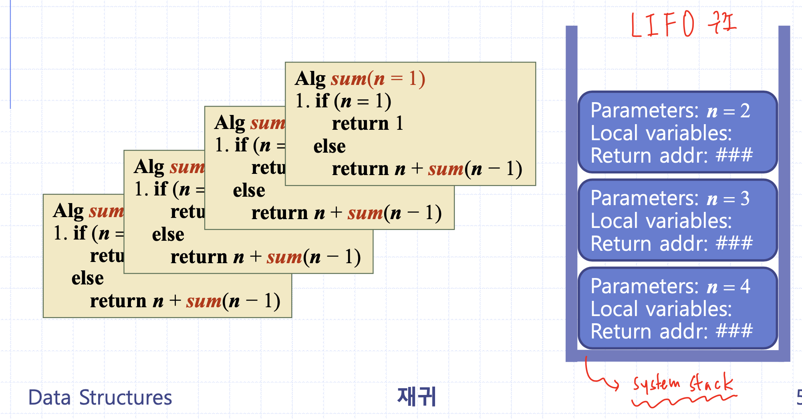
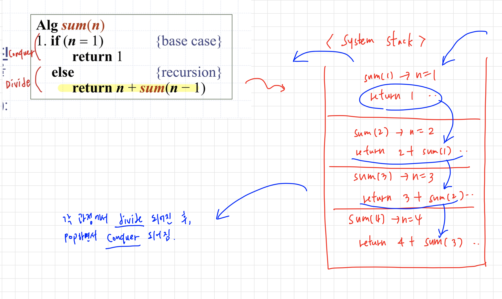
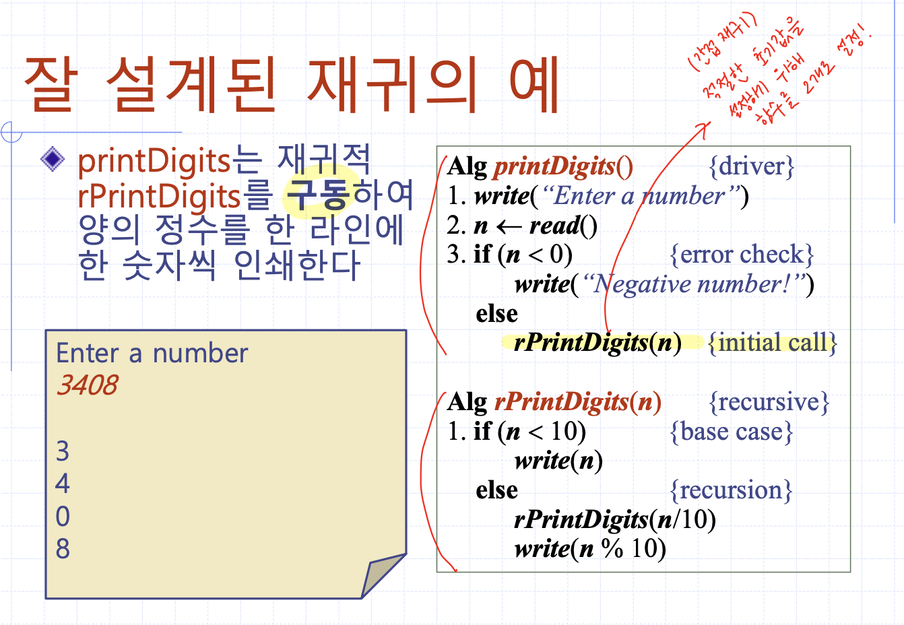
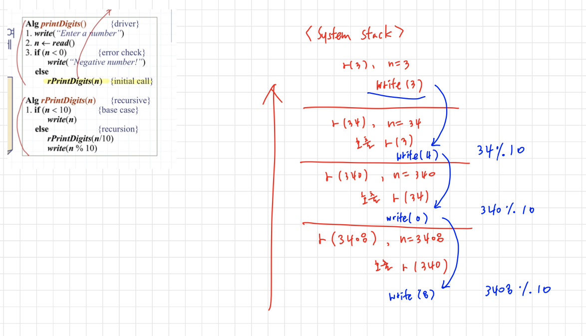

## 재귀
### 2.1 재귀 알고리즘  
  * [추가]   
  -비재귀적(nonrecursive) or 반복적(iterative) 알고리즘
  -재귀적(recursive) or 분할정복(divide and conquer) 알고리즘
  * 알고리즘 자신을 사용해 정의된 알고리즘을 '**재귀적(recursive)**'이라고 말함
  →비재귀적 or 반복적 알고리즘과 대조   
  * 재귀의 요소   
  1.**재귀 케이스(recursion)**
    - 차후의 재귀호출은 작아진 부문제들(subproblems)을 대상으로 이루어짐   

  2.**베이스 케이스(base case)**
    - 부문제들이 충분히 작아지면, 알고리즘은 더이상 재귀를 사용하지 않고 직접 해결함
  ```
  Alg sum(n)   
    1. if(n=1) return 1 {base case}
    2. else return n + sum(n-1) {recursion}
  ```

### 2.2 재귀의 작동원리   
- 보류된 재귀호출(즉, 시작했지만 완료하지 않고 대기중인 호출들)에 대한 변수 관련 저장&복구는 컴퓨터에 의해 자동적으로 수행됨




### 2.3 재귀의 기본 규칙
* 베이스 케이스   
-항상 가져야 하며(재귀 끝날 조건), 재귀를 더이상 사용하지 않고 해결될 수 있어야 함
* 진행 방향   
-재귀적으로 해결되어야 할 경우, 재귀호출은 항상 베이스 케이스를 향하는 방향으로 진행되어야 함(점점 값이 작아져야)
* 정상작동 가정     
-모든 재귀호출이 제대로 작동한다고 가정!
* 적절한 사용   
-꼭 필요할 때만 사용   
  →저장&복구 때문에 성능 저하 가능성
  →함수 호출에 대한 오버헤드 발생 → 분할 정복법이 적당한 경우를 제외하고는 대부분 반복문 사용이 훨씬 용이함
* 예시   
  1. 잘못 설계된 재귀
  - 베이스 케이스가 없거나 도달 불가능(함수 끝나지 않을 때)
  - 베이스 케이스를 향해 작아진 부문제를 대상을 재귀하지 않을 때
  - 부정확한 결과, 미정지, 저장을 위한 기억장소 고갈  
  2. 잘 설계된 재귀
  
  
  
### 2.4 응용 문제
* 재귀적 곱하기와 나누기
조건: 덧셈과 뺄셈 산술연산자만 사용
A. a와 b의 곱을 계산하는 재귀 알고리즘   

  ```
  Alg product(a,b) -> a*b = a를 b번 더하기 
	input positive integer a, b
	output product of a and b
	if(b=1) return a {base case}
	else return a + product(a, b-1) {recursion}
  ```
B. a를 b로 나눈 나머지를 계산하는 재귀 알고리즘   

  ```
  Alg modulo(a,b)
	output a % b
	if(a<b) return a {base case}
	else return modulo(a-b, b) {recursion}
  ```
C. a를 b로 나눈 몫을 계산하는 재귀 알고리즘   

  ```
  Alg quotient(a,b) -> 나눠지는 횟수 count
	output a/b
	if(a<b) return 0 {base case}
	else return 1 + quotient(a-b, b) {recursion}
  ```

* 하노이 탑(이중재귀)   
n개의 원반에 대해 (2^n)-1 회의 이동이 필요함   

  ```
  Alg hanoi(n)
  1. rHanoi(n, 'A', 'B', 'C') {initial call}
  2. return 

  Alg rHanoi(n, from, aux, to) {recursive}
	input integer n, from, aux, to
	output move sequence
  1. if(n=1) {base case}
		write("move from", from, "to", to)
		return
  2. rHanoi(n-1, from, to, aux) {recursion}
  3. write("move from", from, "to", to)
  4. rHanoi(n-1, aux, from, to) {recursion}
  5. return 
  ```   
설명)
  hanoi()는 매개변수들을 사용해 재귀적 rHanoi()를 구동함
  - n : 이동해야 할 원반 수 
  - from : 출발 말뚝
  - aux : 보조 말뚝 
  - to : 목표 말뚝